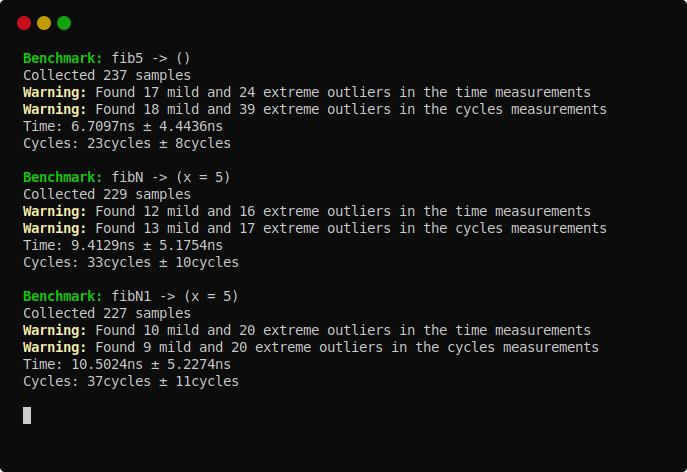

# criterion

[](https://github.com/disruptek/criterion/actions?query=workflow%3ACI)
[](https://github.com/disruptek/criterion/releases/latest)

[](#license)
[](https://www.buymeacoffee.com/disruptek)

A statistics-driven micro-benchmarking framework heavily inspired by the
wonderful [criterion](https://github.com/bos/criterion) library for Haskell;
originally created by [LemonBoy](https://github.com/LemonBoy).

## Status

Works, API is still not 100% stable yet.

## Example

```nim
import criterion

var cfg = newDefaultConfig()

benchmark cfg:
  func fib(n: int): int =
    case n
    of 0: 1
    of 1: 1
    else: fib(n-1) + fib(n-2)

  # on nim-1.0 you have to use {.measure: [].} instead
  proc fib5() {.measure.} =
    var n = 5
    blackBox fib(n)

  # ... equivalent to ...

  iterator argFactory(): int =
    for x in [5]:
      yield x

  proc fibN(x: int) {.measure: argFactory.} =
    blackBox fib(x)

  # ... equivalent to ...

  proc fibN1(x: int) {.measure: [5].} =
    blackBox fib(x)
```

Gives the following output:


A bit too much info? Just set `cfg.brief = true` and the results will be output
in a condensed format:



Much easier to parse, isn't it?

If you need to pass more than a single argument to your benchmark fixture just
use a tuple: they are automagically unpacked at compile-time.

```nim
import criterion

let cfg = newDefaultConfig()

benchmark cfg:
  proc foo(x: int, y: float) {.measure: [(1,1.0),(2,2.0)].} =
    discard x.float + y
```

## Export the measurements

If you need the measurement data in order to compare different benchmarks, to
plot the results or to post-process them you can do so by adding a single line
to your benchmark setup:

```nim
let cfg = newDefaultConfig()

# Your usual config goes here...
cfg.outputPath = "my_benchmark.json"

benchmark(cfg):
  # Your benchmark code goes here...
```

The data will be dumped once the block has been completed into a json file
that's ready for consumption by other tools.

## Documentation
See [the documentation for the criterion module](https://disruptek.github.io/criterion/criterion.html) as generated directly from the source.

## More Test Output

[The source of the `many` test.](https://github.com/disruptek/criterion/blob/master/tests/many.nim)


## License
MIT
